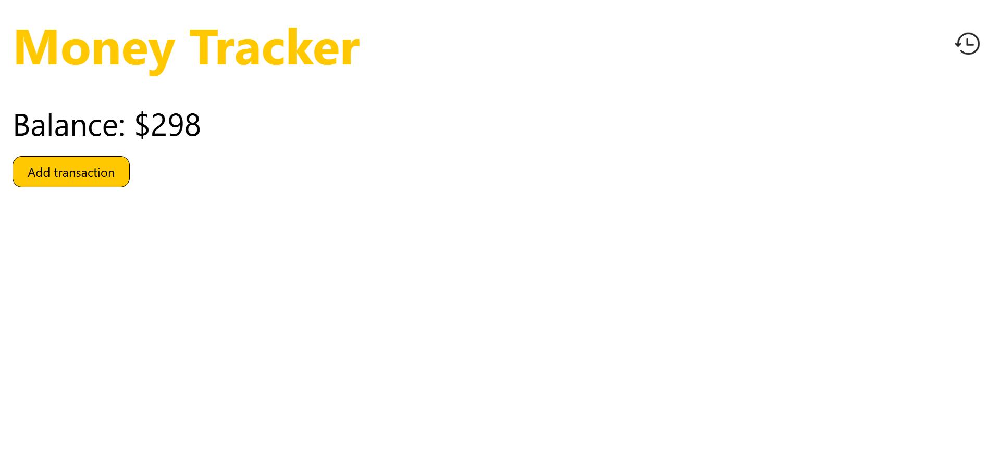
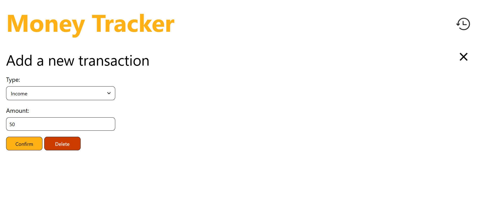
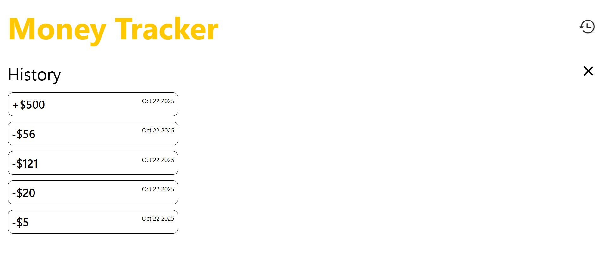

# Money Tracker




A fully responsive, minimalist money tracker.

Originally, this was meant to be a desktop app, but this plan was aborted because of certain issues.
For more details on this, check out <a href="#future-plans">future plans</a>.

## Table Of Contents
1. [Installation](#installation)
2. [Usage](#usage)
3. [Tech Stack](#tech-stack)
4. [Known Issues](#known-issues)
5. [Future Plans](#future-plans)
5. [Author](#author)
6. [License](#license)

## Installation
Copy this repository's link: 
```
https://github.com/logicalPanda2/money-tracker-project.git
```
Then, in Git Bash, navigate to the directory you want the cloned repository to be in:
```
$ cd example_directory
```
Then, type in the command `git clone` along with the copied link:
```
$ git clone https://github.com/logicalPanda2/money-tracker-project.git
```
Wait until all processes are done, indicating the repository is successfully cloned.

## Usage
Navigate to the index.html file in the `src` folder, then open it directly in your browser.

## Tech Stack
- HTML5
- CSS3 (Flexbox)
- JavaScript (ES6)

## Known Issues
As of now, there are no known issues.

Issues are welcome! Please open an issue in the repository when encountering new bugs.

## Future Plans
This project is planned to be a desktop app. Expect these features in the near future:
1. Local balance and history saving: the balance and previous history logs will persist between sessions.
2. Manual balance update: enables users to update their balance without making a transaction.
3. Clear history: enables users to delete all or a certain part of their history. This feature will also include options about whether the balance will be affected or not by the deletion.
4. Additional support: other currencies will be supported, and users can set this upon first using the app.
5. Settings page: enables users to change currencies and convert balance seamlessly.

## Author
Marcelino Romeo @logicalPanda2 (https://github.com/logicalPanda2)

## License
This project is licensed under the <a href="LICENSE.txt">MIT</a> License.